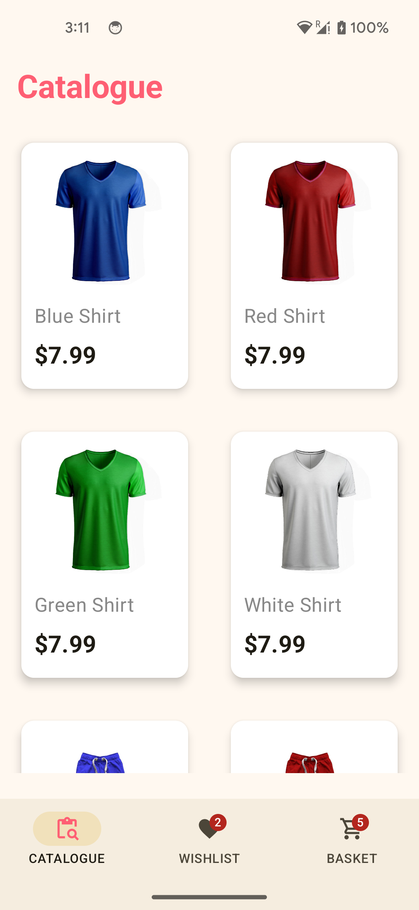
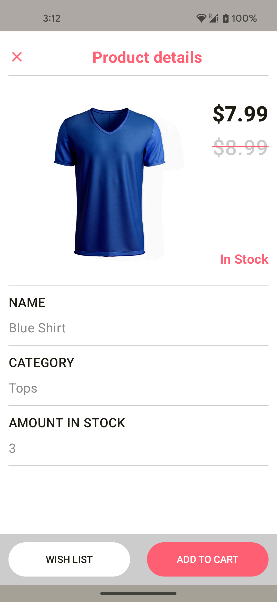
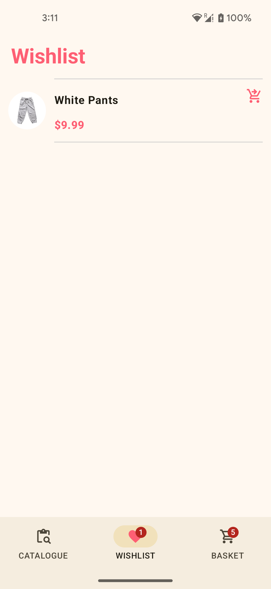
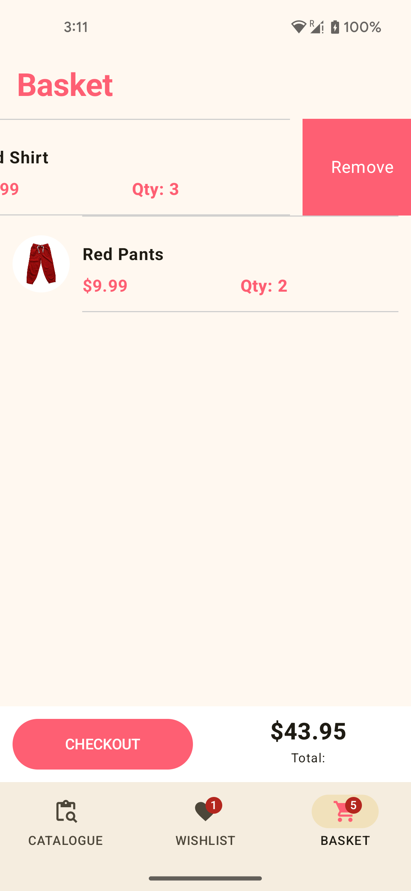

# Clothes Store

## Description

Android app built with jetpack compose that displays data from the remote data source. The home screen will show a list of clothes, each featuring an image and key details. When a user selects an item, it will be navigated to a detail screen with more in-depth information about that clothes. The project should adhere to SOLID principles and follow a clean architecture design pattern.

## Detailed Project Description

## 1. Technology Stack:

### 1.  UI Layer

    * Jetpack Compose: For building declarative and reactive UIs.
    * Material Design 3: Ensures a modern, visually appealing interface.

### 2.  Data Layer

    * Retrofit: To fetch data from the remote API.
    * Room Database: For local caching of clothing data.
    * Kotlin Coroutines & Flow: For asynchronous programming and reactive data streams.

### 3.  Dependency Injection

    * Hilt: Simplifies dependency injection for a clean separation of concerns

### 4.  Kotlin
### 5.  mockk - for unit testing
### 6.  Coil - Image Loader library.
### 7.  API - https://api.npoint.io/0f78766a6d68832d309d

## 2. Features:

    * Catalogue View: This view displays in a vertical scrolling view the catalogue of products from the JSON endpoint.
    * Detail View: This view displays in a vertical scrolling view the detail of the selected item in the Catalogue View.
    * Wishlist View: This view displays in a vertical scrolling view the items that you have added to your wishlist.
    * Basket/Cart View: This view displays in a vertical scrolling view the items added to the Basket/Cart.

## 3. Architecture:

###   Clean Architecture Layers:
    * Presentation Layer: Jetpack Compose UI interacting with ViewModels.
    * Domain Layer: Use Cases handling the business logic.
    * Data Layer: Repository pattern for data handling (remote and local).
###   SOLID Principles: Ensures code flexibility and maintainability.

## 4. Implementation:

    * Shared ViewModel: A shared ViewModel is used to manage the state and share data between the screens.
    * Type-Safe Navigation: The Navigation Component is used with type-safe arguments to navigate between screens.

## Design Pattern

    * The application is developed using Test-Driven Development (TDD) and follows the Model-View-ViewModel (MVVM) design pattern.

## Further enhancements

    * Checking stock count before adding items into the basket.
    * Furthermore cosmetics and refactoring is an endless thought.

### Note: The application was created using the latest Android Studio version, Ladybug. It may not be fully compatible with older versions of Android Studio.

## Snapshots

